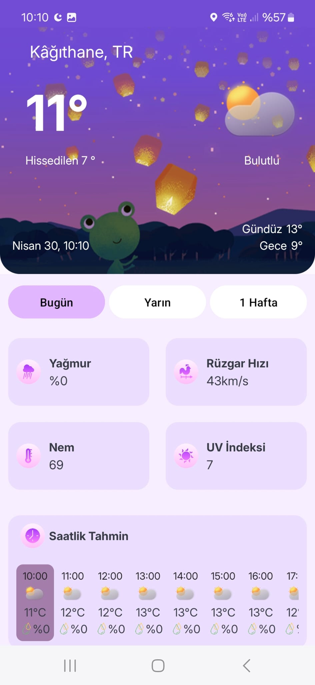
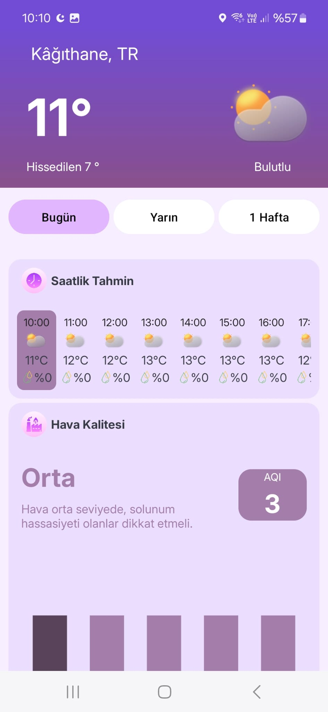
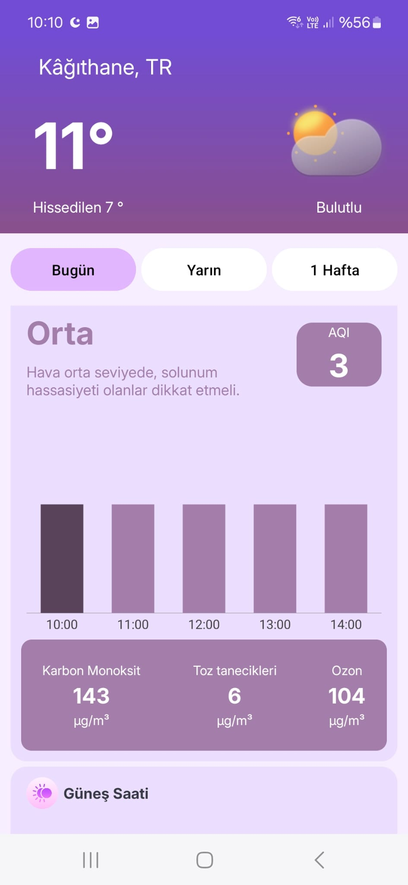
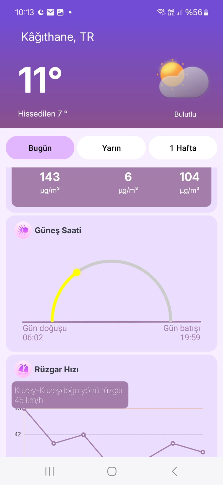
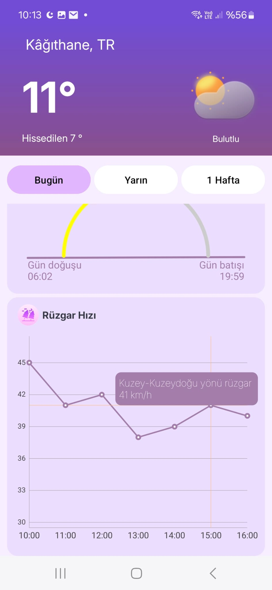
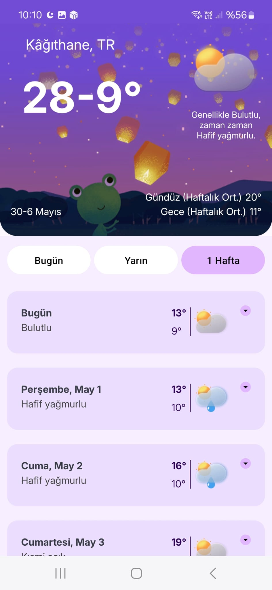
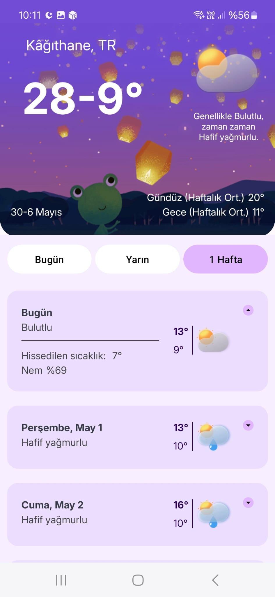

# 🌦️ Weatherly - Android Weather App

Weatherly is a lightweight and efficient Android weather app crafted with Kotlin and powered by a clean MVVM architecture. It delivers accurate real-time weather updates, detailed hourly and daily climate insights, and environmental air quality metrics. Leveraging the strengths of both OpenWeather and Open-Meteo APIs, Weatherly transforms raw meteorological data into meaningful information—tailored for a smooth and responsive mobile experience.

## 🚀 Technologies

- **Language**: Kotlin
- **Architecture**: MVVM
- **Dependency Injection**: Hilt (Dagger)
- **Networking**: Retrofit
- **Image Loading**: Picasso
- **JSON Parsing**: Gson
- **UI Management**: ViewBinding
- **Navigation**: AndroidX Navigation Component

## 📦 APIs Used
OpenWeatherMap – for real-time weather & air pollution

Open-Meteo – for hourly & daily weather forecasts

## 🧠 Architecture Overview
```plaintext
📦 data
 ┣ 📂model              → API response data models
 ┣ 📂network            → Retrofit service interfaces
 ┗ 📂repository         → Repository implementation layer

📦 domain
 ┗ 📂repository         → Abstract repository interfaces

📦 di
 ┗ 📂                   → Hilt module for dependency injection

📸 Screenshots
<table> <tr> <td align="center"></td> <td align="center"></td> <td align="center"></td> </tr> <tr> <td align="center">Splash</td> <td align="center">Home</td> <td align="center">Hourly Forecast</td> </tr> <tr> <td align="center"></td> <td align="center"></td> <td align="center"></td> </tr> <tr> <td align="center">Air Quality</td> <td align="center">Sunrise/Sunset</td> <td align="center">Wind Speed</td> </tr> <tr> <td align="center"></td> <td align="center"></td> <td align="center"></td> </tr> <tr> <td align="center">7-Day Forecast (1)</td> <td align="center">7-Day Forecast (2)</td> <td align="center"></td> </tr> </table>